# Digital Notes

## Εκτέλεση υπηρεσίας
Για να εκτελεστεί η υπηρεσία ο χρήστης θα πρέπει:
- Να έχει εγκαταστήσει docker στον υπολογιστή του, και να το τρέχει.
- Να βρίσκεται στο φάκελο /app και να εκτελέσει την εντολή ``docker-compose up``
- Να ανοίξει τον browser του στο http://localhost:5000 (η υπηρεσία έχει δοκιμαστεί μονο στο Google Chrome)
- Ο χρήστης που τρέχει την υπηρεσία να είναι admin
- Η βάση δεδομένων mongodb είναι προσβάσιμη στο URI ``mongodb://localhost:27018``. Το όνομα της database είναι ``DigitalNotes``

## Λειτουργίες συστήματος
### Home
Η πρώτη σελίδα που πρέπει να δει ο χρήστης όταν ξεκινήσει την υπηρεσία. Μέσα απο αυτή του δίνονται οι παρακάτω επιλογές.
#### Ο χρήστης δεν έχει συνδεθεί
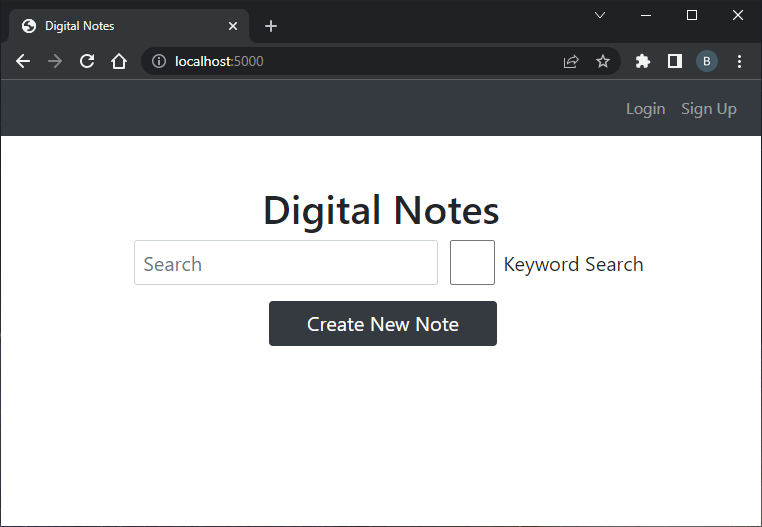
#### Ο χρήστης έχει συνδεθεί
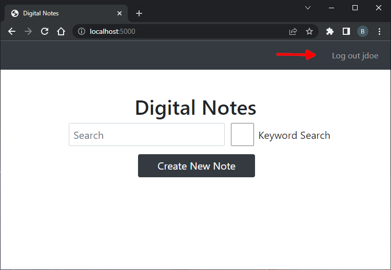
### Login
Σε αυτή τη σελίδα ο χρήστης μπορεί να εισάγει το email και το password που δημιούργησε στη σελίδα Signup.
#### Αν βάλει λάθος στοιχεία
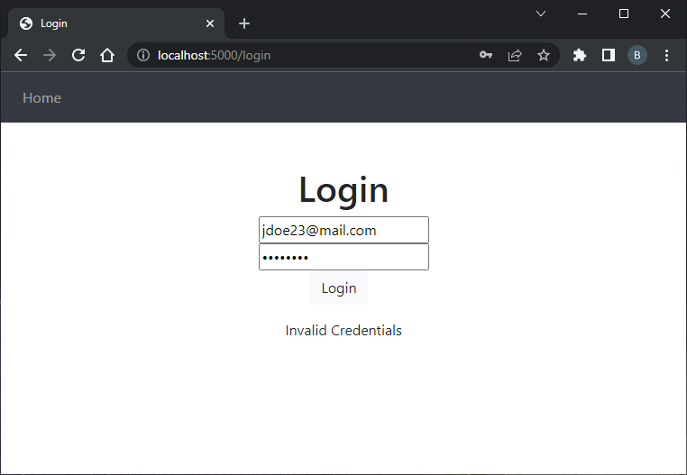
### Signup
Σε αυτή τη σελίδα ο χρήστης μπορεί να εγγραφεί στο σύστημα.
#### Αν δεν συμπληρώσει όλα τα στοιχεία
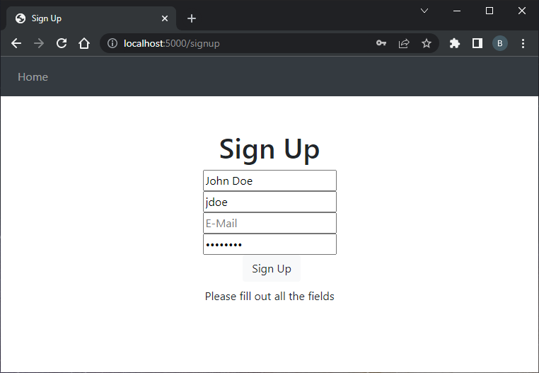
#### Αν βάλει ήδη υπάρχον email
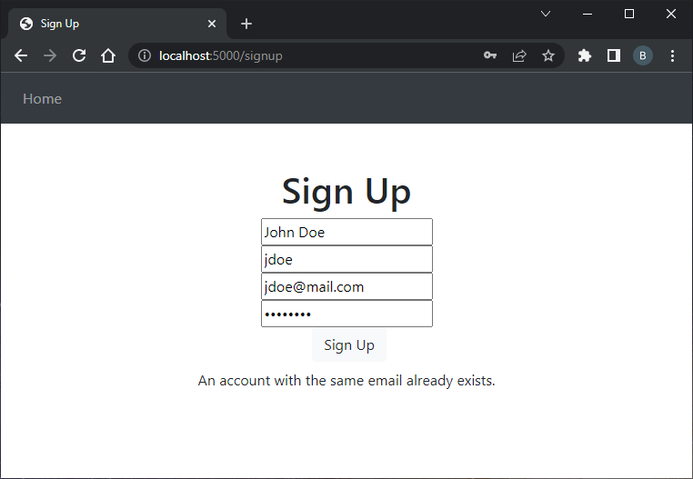
#### Αν βάλει ήδη υπάρχον username
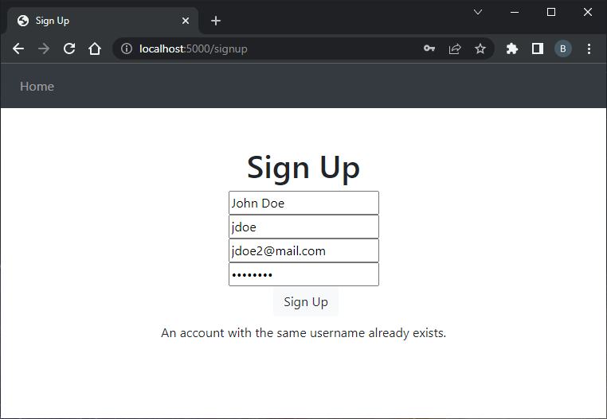
### Search
Η λειτουργία αυτή βρίσκεται στο στη σελίδα Home και δίνει τη δυνατότητα στο χρήστη να ψάξει μια σημείωση του χρησιμοποιώντας τον τίτλο της. Ο χρήστης πρέπει να πληκτρολογίσει τον τίτλο που επιθυμεί και αρκεί μετά να πατήσει το enter στο πληκτρολόγιο.
#### Αν δεν έχει συνδεθεί ο χρήστης
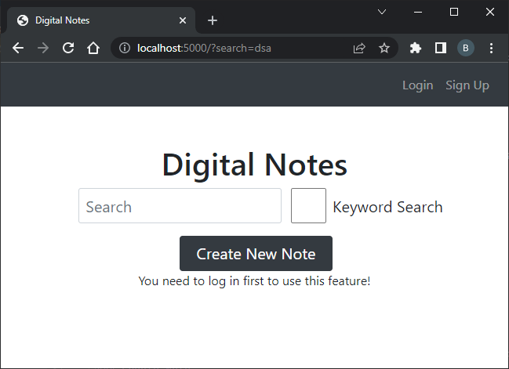
### Create Note
Σε αυτή τη σελίδα ο χρήστης μπορεί να προσθέσει μια νέα σημείωση
#### Παράδειγμα χρήσης
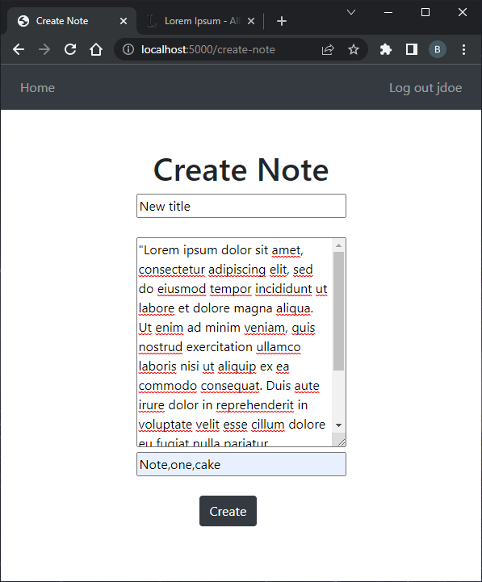
#### Αν βάλει τίτλο που ήδη υπάρχει
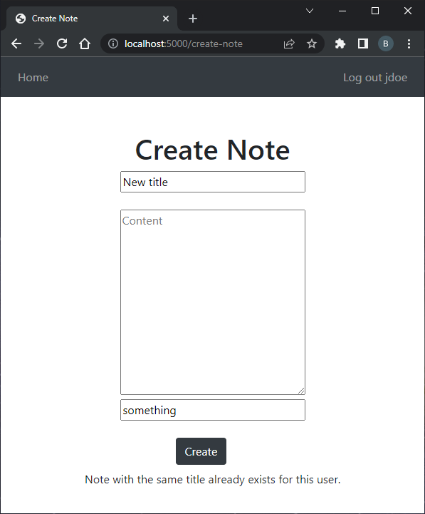
### Note
Σε αυτή τη σελίδα εμφανίζεται το αποτέλεσμα της αναζήτησης
### Παράδειγμα χρήσης
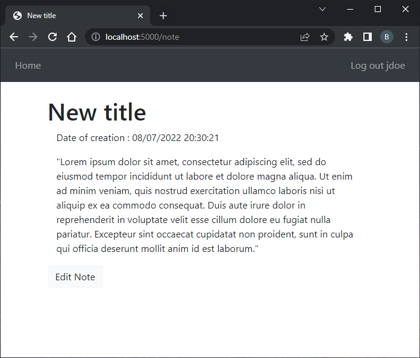
### Admin Page
Σε αυτή τη σελίδα έχει πρόσβαση μόνο ένας διαχειρηστής. Όταν τρέχει για πρώτη φορά η υπηρεσία υπάρχει ήδη ενας διαχειρηστής. Τα στοιχεία για το login είναι: ``Email : admin@mail.com | Password : admin``.
### Homepage αν έχει συνδεθεί ο διαχειρηστής
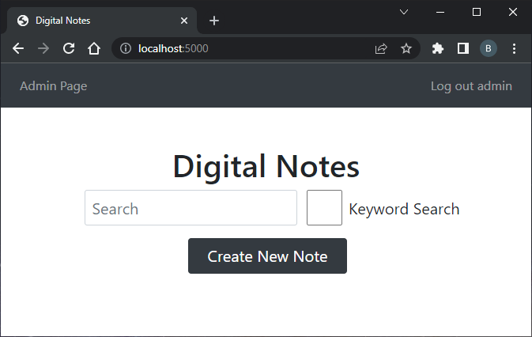
### Σελίδα διαχειρηστή
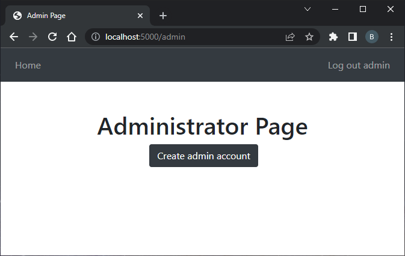
### Create admin account
Σε αυτή τη σελίδα ο διαχειρηστής μπορεί να προσθέσει ενα νεο λογαριασμό με δυνατότητες διαχειρηστή. Έχει λειτουργία όμοια με την sign up
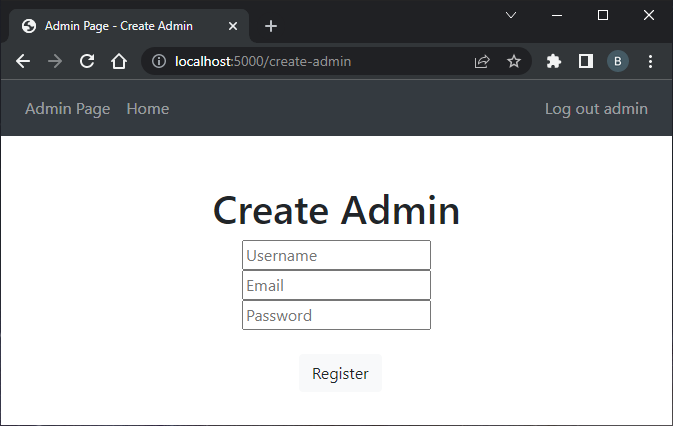

## Σημειώσεις
Σε αυτή τη εργασία δεν έχουν υλοποιηθεί όλες οι λειτουργίες, όπως αναγράφεται στην εκφώνηση. Συγκεκριμένα, δεν έχουν υλοποιηθεί οι παρακάτω λειτουργίες:
- Αναζήτηση σημειώσεων βάσει λέξης κλειδιού
- Διόρθωση / Αλλαγή υπάρχουσας σημείωσης
- Διαγραφή σημείωσης
- Εμφάνιση όλων των σημειώσεων σε χρονολογική σειρά
- Διαγραφή του λογαριασμού του χρήστη
- Κωδικός μιας χρήσης του διαχειριστή
- Διαγραφή χρήστη απο την υπηρεσία